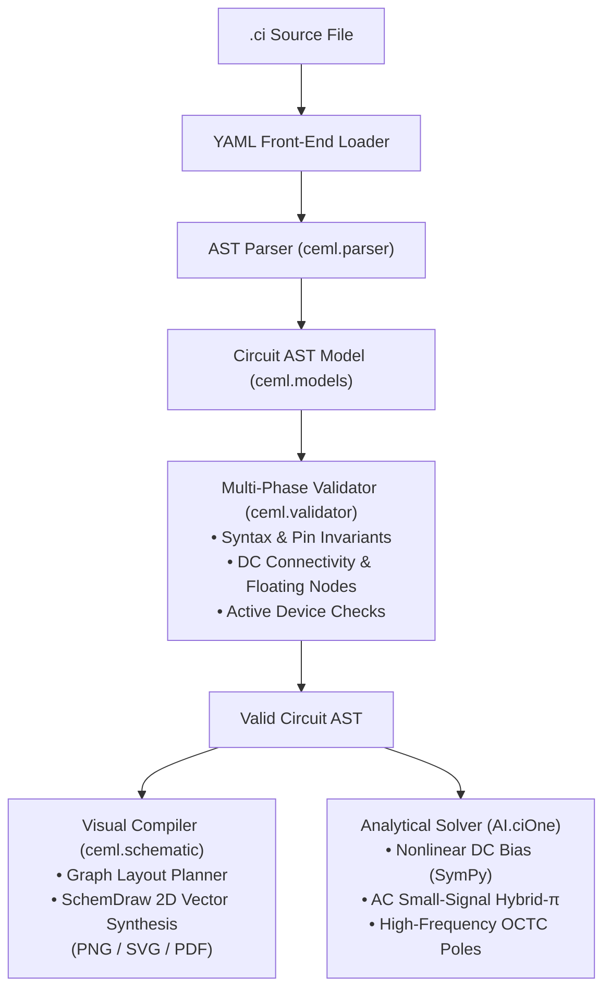

# CEML (`ceml-lang`)

**Circuit Engineering Markup Language (CEML)** is a declarative domain-specific language (DSL) and compiler pipeline designed to formally describe analog microelectronic circuits for **analytical reasoning, symbolic solving, and automated schematic synthesis**.

CEML acts as the formal representation layer for [AI.ciOne](https://github.com/aicione/aicione), bridging human circuit design, formal compiler abstract syntax trees (ASTs), and neuro-symbolic artificial intelligence.

---

## Why CEML? (Beyond SPICE)

Traditional SPICE netlists were engineered decades ago for **numerical differential-equation simulation**. They treat circuits as matrices of numeric conductances:
- SPICE does not differentiate physical operating regimes (DC quiescent bias vs. small-signal AC linearization vs. high-frequency dynamics).
- SPICE does not semantically classify component roles (e.g., distinguishing bias dividers from AC bypass or coupling capacitors).
- SPICE output is strictly `Circuit → Numerical Matrices`, making it opaque to symbolic solvers, Large Language Models (LLMs), and Graph Neural Networks (GNNs).

**CEML inverts this paradigm:**
$$\text{Design Specifications} \longrightarrow \text{Declarative Netlist } (.ci) \longrightarrow \text{Formal AST} \longrightarrow \begin{cases} \text{Symbolic Transfer Functions (AI.ciOne)} \\ \text{Vector Schematics (SchemDraw)} \end{cases}$$

CEML represents circuits as high-level, human-readable, machine-verifiable structures containing explicit topological intent, known parameters (`given:`), and analytical targets (`find:`).

---

## Example Circuit (`.ci`)

```yaml
ceml_version: "0.1"
circuit_id: "ce_amplifier_01"
description: "BJT NPN common-emitter amplifier with resistive bias"

nodes:
    - id: GND
      type: ground
    - id: VCC
      type: supply
      value: 12
    - id: N1
    - id: N2
    - id: Vin
      type: input
    - id: Vout
      type: output

components:
    - id: RC
      type: resistor
      value: 4k7
      pins: [VCC, N1]
    - id: RB
      type: resistor
      value: 47k
      pins: [VCC, N2]
    - id: Q1
      type: BJT
      polarity: NPN
      pins:
        base: N2
        collector: N1
        emitter: GND

specs:
  given:
    - freq: 1k
  find:
    - Av(Vout, Vin)
    - Rin(Vin, GND)
    - Rout(Vout, GND)
```

---

## Compiler Architecture & Pipeline



---

## Features & Capabilities

- **Strict Language Specification:** Governed by [`spec/ceml-v0.1.md`](spec/ceml-v0.1.md), defining canonical grammar, metric prefix notation (e.g. `4k7`, `2.2M`, `10p`), pin mappings, and 30 recorded language design decisions.
- **Robust Semantic Validator:** Enforces topological well-formedness, ground reference requirements, polarity definitions, and solvability constraints prior to downstream execution.
- **Visual Schematic Compiler (`ceml.schematic`):** Automatically analyzes circuit topology, separates supply/ground rails, plans planar stages (Common Emitter, Common Collector, Common Base, MOSFET Common Gate/Drain/Source), and synthesizes publication-grade vector schematics without wire crossings.
- **Unified CLI:** Direct command-line interface for linting, AST inspection, and diagram rendering.
- **Architecture Decision Records (ADRs):** Comprehensive architectural evolution documented under [`decisions/`](decisions/README.md).

---

## Quick Start

### Installation

```bash
# Clone the repository
git clone git@github.com:aicione/ceml-lang.git
cd ceml-lang

# Install with development and rendering extras
pip install -e ".[dev,render]"
```

### Command-Line Usage

```bash
# 1. Validate a circuit specification against the formal grammar
ceml check examples/ce_partial_bypass_coupled_load.ci

# 2. Inspect the extracted AST model, nodes, and device pins
ceml inspect examples/ce_partial_bypass_coupled_load.ci

# 3. Render publication-grade circuit schematic (.png, .svg, or .pdf)
ceml render examples/ce_partial_bypass_coupled_load.ci -o schematic.png
```

---

## Repository Structure

```
ceml-lang/
├── spec/
│   └── ceml-v0.1.md         # Formal language specification & decision records
├── decisions/               # Architecture Decision Records (ADR 0001 - 0008)
├── examples/                # Worked analog circuit benchmarks (.ci)
├── ceml/
│   ├── __init__.py          # Public API (load, loads, validate, render_circuit)
│   ├── models.py            # Strongly-typed AST dataclasses
│   ├── parser.py            # Parser and syntax builder
│   ├── validator.py         # Multi-phase semantic validation rules
│   ├── cli.py               # CLI entrypoint (check, inspect, render)
│   └── schematic/           # 2D Visual schematic compilation engine
│       ├── elements.py      # SchemDraw primitive mapping & polarity
│       ├── layout.py        # Graph topology analysis & stage coordinates
│       └── renderer.py      # Orthogonal planar drawing builder
├── tests/                   # Test suite (39 automated pytest tests)
│   └── output/              # Generated visual schematic test artifacts
├── pyproject.toml           # Project configuration & dependencies
└── README.md
```

---

## Architecture Decision Records (ADRs)

Key architectural choices are formally tracked in [`decisions/`](decisions/README.md):
- [ADR 0001](decisions/0001-adoption-of-adrs.md): Adoption of Architecture Decision Records
- [ADR 0002](decisions/0002-formal-spec-as-source-of-truth.md): Formal Specification as Single Source of Truth
- [ADR 0003](decisions/0003-ast-data-model-design.md): AST Data Model Design
- [ADR 0004](decisions/0004-testing-framework-and-virtualenv.md): Adoption of Pytest and Virtual Environment
- [ADR 0005](decisions/0005-cli-interface-and-entrypoints.md): Command Line Interface (CLI) and Entrypoints
- [ADR 0006](decisions/0006-frequency-response-and-symbolic-values.md): Frequency-Response Functions and Symbolic Values
- [ADR 0007](decisions/0007-separation-of-concerns-and-aicione-solver-delegation.md): Separation of Concerns & Solver Delegation to AI.ciOne
- [ADR 0008](decisions/0008-schematic-rendering-engine-and-schemdraw-mapping.md): Visual Schematic Rendering Engine & SchemDraw Mapping

---

## License

MIT License — see [LICENSE](LICENSE).
